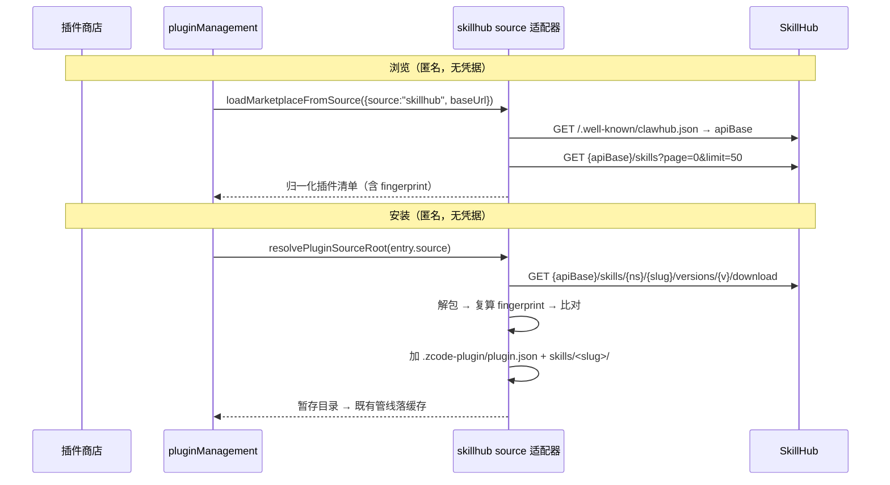

# AIHub 技能市场（SkillHub 作为内置插件来源）

## 背景与目标

公司 AIHub（`https://aihub.ucas.com.cn`）的技能平台 SkillHub 已有 29 个技能（自研的 `kb-search`、`translate`、`pdf-toolkit`，以及镜像来的 `ask-matt`、`code-review`、`docx`、`pptx` 等）。员工目前只能从网页下载 zip、手工解压到技能目录，安装与更新都没有入口。

本能力让 UWork **内置**一个「UCAS AIHub」插件市场，由客户端适配 SkillHub 的接口，把技能包包装成插件安装：

1. 开箱可见：不需要员工手工填写来源，设置 → 插件商店里直接出现该市场与技能列表。
2. 一键安装/更新：安装落进 UWork 自己的插件缓存，技能经插件技能根进入 `Skill` 工具。
3. 完整性可校验：安装前用 SkillHub 的内容指纹复算校验，不通过不落盘。
4. 账号一致性：**本期不绑定账号**（见 3.3）——公开技能全部匿名消费，不引入 token，因此不存在「绑错人」的风险；绑定是后续工作，且前提是先有服务端 join（L2）。

## 产品规则

- 市场固定 id `ucas-aihub`（满足 `MARKETPLACE_NAME_PATTERN = /^[a-z0-9][a-z0-9._-]{0,127}$/`，见 `apps/zcode-cli/packages/adapters/src/plugins/marketplace.ts:61`），作为**默认市场**随包 seed，并计入商店的**「公司」分段**（见下）。
- 商店分三段：**公开 / 公司 / 个人** —— 公开是 ZCode 官方市场（保留 Featured 策展），公司是内部 AIHub 技能市场（受控来源、独立成段、不可删除），个人是用户自加来源。公司技能**不混进公开列表**。
- 技能即插件：SkillHub 的技能包在客户端包装成插件安装 —— 生成 `.zcode-plugin/plugin.json`，原始技能内容放进 `skills/<slug>/`。理由：UWork 插件**必须有 manifest**（缺了报 `plugin_manifest_not_found`），而官方市场本身就是「技能打包成插件」（`documents`/`pdf`/`presentations`/`spreadsheets`）。
- 完整性以 **SkillHub 的内容指纹**为准，不用 zip 字节摘要 —— 服务端不发布 bundle 的 sha256，只发布按文件复合的 `fingerprint`（见下）。校验失败即安装失败，不写缓存、不注册。
- 匿名只读：公开（PUBLIC）技能匿名即可列出与下载，**本期全部请求不带任何凭据**（见 3.3）。私有/命名空间技能不在本期范围。
- 将来若引入账号（见 3.4），凭据边界按硬规则执行：token 只发往配置的 aihub 源主机；manifest 里出现的任何 URL 一律不带 token（防止源被改写后外泄凭据）。
- 目录卫生：与官方市场重复的技能（`docx`/`pptx`/`xlsx`）默认不在本市场展示，避免员工看到两套同名能力。
- 隔离：安装产物与启用状态都落 UWork 自己的根（`~/.uwork/cli/plugins/...` 与 `~/.uwork/cli/config.json`，见 `specs/uwork-data-root-separation.md`；该缺口已于 2026-10-08 修复）。
- 只读方向：本期只做「从 SkillHub 装到 UWork」，不做反向发布。

## 所有者与边界

| 事实                                  | 所有者                                                             | 说明                          |
| ------------------------------------- | ------------------------------------------------------------------ | ----------------------------- |
| 技能目录、版本、内容指纹              | SkillHub（服务端）                                                 | 唯一事实源；UWork 只读        |
| 市场定义（id/名称/来源/是否公开分区） | `packages/shared/src/plugin-marketplaces.ts`                       | 与官方市场同一处声明          |
| `skillhub` 源适配（发现/解析/落盘）   | `adapters/src/plugins/`（新增 source case）                        | 不新增进程，走既有插件管线    |
| 安装产物                              | 插件缓存 `~/.uwork/cli/plugins/cache/ucas-aihub/<slug>/<version>/` | 与其它市场同构，复用卸载/更新 |

依赖方向：UI → `pluginManagement` RPC → 适配器 → SkillHub HTTP。适配器不接触企业身份 JWT，本期也不持有任何 SkillHub 凭据。

## 服务端契约（2026-10-07 实测 + 源码核对）

基址：`https://aihub.ucas.com.cn/skillhub`（对内网解析到 145，由它终止 TLS 并转发到 143 的 18081）。发现文档 `GET {base}/.well-known/clawhub.json` 返回 `{"apiBase":"/skillhub/api/v1"}`，客户端以它为准，不要硬编码前缀。

| 用途       | 请求                                                           | 返回                                                                                                                                 |
| ---------- | -------------------------------------------------------------- | ------------------------------------------------------------------------------------------------------------------------------------ |
| 目录       | `GET {apiBase}/skills?page=0&limit=50`                         | `{items:[{slug,displayName,summary,tags,stats,createdAt,updatedAt,latestVersion:{version,createdAt,changelog,license}}],nextCursor}` |
| 详情       | `GET {apiBase}/skills/{ns}/{slug}`                             | `{code,msg,data:{…,visibility,status,hidden,namespace}}`（enveloped）                                                                |
| 解析版本   | `GET {apiBase}/skills/{ns}/{slug}/resolve`                     | `{data:{skillId,namespace,slug,version,versionId,fingerprint,matched,downloadUrl}}`                                                  |
| 单版本文件 | `GET {apiBase}/skills/{ns}/{slug}/versions/{version}/files`    | 每个文件 `{filePath,fileSize,contentType,sha256}`                                                                                    |
| 下载       | `GET {apiBase}/skills/{ns}/{slug}/versions/{version}/download` | `200 application/zip`，`content-disposition: attachment; filename="<slug>-<version>.zip"`                                            |
| 设备码     | `POST {apiBase}/auth/device/code`（无 body）                   | `{deviceCode,userCode,verificationUri,expiresIn:900,interval:5}`                                                                     |
| 设备码轮询 | `POST {apiBase}/auth/device/token {deviceCode}`                | `{accessToken,tokenType:"Bearer",error}`；等待中 `error="authorization_pending"`；失效报 `error.deviceAuth.deviceCode.expired`       |

契约要点（都已核对，容易踩）：

> 上表里**设备码两行只属于后续绑定路径（3.4），本期不调用**；其余四行是本期实现要用的全部接口。

- 目录分页 `page` **0 起算**、`limit` 默认 25；**越界返回空数组而不是报错**，翻页要用 `nextCursor`（末页为 `null`），不能靠「空列表」判断结束。
- `resolve` 返回的 `downloadUrl` 是**应用根相对**路径（实测 `/api/v1/skills/…/download`，不带部署前缀 `/skillhub`，它不像 well-known 那样回显 `X-Forwarded-Prefix`）。**不能用 `new URL(path, baseUrl)` 拼接** —— 路径绝对解析会把 `/skillhub` 整段丢掉（实测直接 404）；必须显式把 baseUrl 的路径前缀接回去，且已带前缀时不能重复拼。
- `fingerprint` 是**按文件复合**的内容哈希，不是 zip 字节摘要（实测 `kb-search`：fingerprint `ad6b8a9b…`，而本地算出的 zip sha256 是 `1626be9d…`）。算法（`SkillQueryService.computeFingerprint`）：文件按 `filePath` 升序，逐个拼接 `"${path}:${fileSha256}\n"`（UTF-8）喂入 SHA-256，输出加前缀 `sha256:`。客户端解包后按同一算法复算即可校验。
- 设备的 `verificationUri` 是服务端配置项（默认 `/cli/auth`）；`device-auth` 的两个 POST 免 CSRF，只带 Bearer 的请求也不需要 CSRF。
- 匿名下载受限速（按 IP+cookie 滑动窗口，超限 429 且**不带 `Retry-After`**），客户端要退避重试而不是立即重试。

## 客户端设计

### 1. 新增市场源类型 `skillhub`

落点（沿用既有管线，不引入新进程；实现拆成三个文件，都控制在 400 行以内）：

- `adapters/src/plugins/skillhub-common.ts`：HTTP/JSON 读取与共用规则 —— `normalizeSkillhubBaseUrl`（只允许 HTTPS 或回环 HTTP）、规范 slug 反解（第一个 `--` 处切分）。
- `adapters/src/plugins/skillhub-source.ts`：**市场化** —— `discoverSkillhubApiBase`（well-known 优先，缺失回退 `/api/v1`，跨 origin 声明拒绝）、`fetchSkillhubCatalog`（按 `nextCursor` 翻页）、`buildSkillhubMarketplaceManifestRaw`（含隐藏清单）。
- `adapters/src/plugins/skillhub-package.ts`：**安装化** —— `readSkillhubPluginSource`、`resolveSkillhubVersion`、`resolveSkillhubPluginSource`、`computeSkillhubFingerprint`/`hashSkillDirectory`。
- `config/schema.ts`：`pluginMarketplaceSourceSchema` 联合新增 `{source:"skillhub", baseUrl, name?, description?}`（`.strict()`）；`@zcode/contracts` 的 `PluginMarketplaceSourceConfig` 同步加一支。
- `marketplace.ts`：`MarketplaceSource` 联合加成员；`loadMarketplaceFromSource`（`:1508`，分发 switch 在 `:1514`）加 case —— 只落 manifest（与 `url` 源一致，走 `stageMarketplaceManifest`）；`resolvePluginSourceRoot`（`:1189`）加 case 委托给 `resolveSkillhubPluginSource`；`validateMarketplaceEntryShape` 提前校验条目字段；`getMarketplaceSourceValidationDeferral` 纳入 `skillhub`（市场级 validate 不逐个下载）；`parseMarketplaceSourceInput`（`:221`）支持手填 `skillhub:<baseUrl>`。
- **条目 source 形状**：`{source:"skillhub", baseUrl, apiBase, namespace, slug, version}`。目录条目**不含指纹** —— compat 列表不返回指纹，指纹在安装时向原生 `resolve` 取，因此不必（也不应）把指纹写进 manifest。
- **更新检测走版本轴**：版本号形如 `20260920.142519`，`semver.coerce` 能解析成合法 semver（`20260920.142519.0`），`comparePluginVersions` 的比较对日期版本天然有效；`readPluginSourceIdentityPin` 不为 skillhub 另造 pin 轴，避免「包变了但版本没变」时把无法证明的新旧关系误报成更新。
- **落地路径**：`~/.uwork/cli/plugins/cache/ucas-aihub/<slug>/<version>/`，由既有 `cacheMarketplacePlugin` 负责拷贝与原子激活。
- 适配器只从 `baseUrl`/`apiBase` 拼 URL，并对服务端给的下载地址做同源校验；本期不发任何凭据。

### 2. 内置市场

- `packages/shared/src/plugin-marketplaces.ts`：`DEFAULT_PLUGIN_MARKETPLACES` 增加 `ucas-aihub`，用新增的 `sourceConfig` 声明结构化来源 `{source:"skillhub", baseUrl}`（`source` 字段改为可选，字符串形式仍供官方 CDN 使用）；`ensureDefaultPluginMarketplaces` 优先取 `sourceConfig`。
- `PUBLIC_STORE_MARKETPLACE_IDS` 仅保留官方市场；新增 `COMPANY_STORE_MARKETPLACE_IDS`（= `ucas-aihub`）与 `isCompanyStoreMarketplaceId`、`isCuratedStoreMarketplaceId`（公开 ∪ 公司）。
- 商店分段：`PluginStoreSegment` 扩为 `public | company | personal`（`PluginStoreListView.tsx`），三段各自的浏览面；公司段按市场分组（组标题走品牌展示名）复用个人段的 `MarketplaceGroupsSegment`（仅空态文案不同，新增 `settings.plugins.store.companyEmpty`）。
- 受控来源语义（官方 + 公司）：不可删除（`PluginStoreSourcesDialog.tsx` 的 `isRemovableMarketplace` 改用 curated）、参与自动刷新（`PluginStorePage.tsx` 的循环）、`@` 引用面板与工作区插件预览里排在前一档（`pluginsMentionProvider.ts`、`WorkspacePluginPreview.tsx`）。Featured 策展仍只认官方市场（`pluginStoreListing.ts`）。
- 市场展示名：市场身份就是 manifest name（= id），因此 UI 侧加品牌名映射 `packages/ui/src/settings/pluginSourceLabel.ts`（`ucas-aihub` → `UCAS AIHub`），不改 id。
- 自动刷新泛化：`PluginStorePage.tsx` 改为遍历上方「受控来源集合」逐个刷新，判据模块更名 `settings/marketplaceAutoRefresh.ts`（行为不变：10 分钟窗口 + 发起时占位防抖）。
- 契约测试进 CI：`.github/workflows/desktop-release.yml` 的定向测试清单已加入 `apps/zcode-cli/packages/adapters/test/skillhubSource.test.ts`。

### 3. 账号同步与一致性

#### 3.1 三边各自持有的「人」

| 系统                                                                | 主键                                              | 其他可比对属性                                                                                            | 谁能证明                                                                                                  |
| ------------------------------------------------------------------- | ------------------------------------------------- | --------------------------------------------------------------------------------------------------------- | --------------------------------------------------------------------------------------------------------- |
| UWork 企业身份（`packages/shared/src/enterprise-identity.ts:3-16`） | `profile.id`（= ucas-proxy `users.id`）           | `tenantId`(=org_id)、`displayName`；**没有邮箱/工号/wecom_userid**                                        | ucas-proxy JWT                                                                                            |
| ucas-proxy `users`                                                  | `users.id`；`UNIQUE(org_id, wecom_userid)`        | `wecom_userid`、`name`、`email`（WeCom 目录来源、可空、未验证）、department/position/role；**没有工号列** | WeCom 授权码换到的目录数据                                                                                |
| aihub 平台 `users`                                                  | 平台 `userId`（`usr_…`）；`email UNIQUE NOT NULL` | email、displayName                                                                                        | 平台自己的登录（密码 / SSO）                                                                              |
| SkillHub `user_account`                                             | `id`（`usr_<uuid>`，SkillHub 自生）               | `email`（**非唯一**、每次登录被上游覆盖）、`display_name`                                                 | 无：`identity_binding(platform-sso, subject=平台 userId)` 是唯一与公司身份的连接点，**任何 API 都不暴露** |

#### 3.2 核心结论：客户端无法自证一致

- 设备码流程只证明「某个 SkillHub 账号在浏览器里确认了这个 code」，**不携带任何企业身份**；`sk_` token 只指向 SkillHub 自己的 `user_account.id`。
- `GET /api/v1/auth/me` 只回 `{userId, displayName, email, avatarUrl, oauthProvider, …}`，而 `oauthProvider` 对设备 token 恒为 `api_token`，因此**分辨不出该账号是不是 platform-sso 绑定的那个**。
- 唯一能跨系统比对的属性是 **email**，两边都不权威：SkillHub 侧非唯一且登录时被上游覆盖；ucas-proxy 侧来自 WeCom 目录、可空、员工不可改也未被验证。两套库里都**没有工号**之类的稳定 join key。
- 结论：**「绑定即同一人」在客户端无法保证**，要保证只能靠服务端 join。

#### 3.3 本期范围（L1）：不绑定账号

- 不引入任何 SkillHub 凭据：目录、详情、下载、安装全程匿名，客户端不保存 token，也不做账号绑定 UI。
- 私有（`PRIVATE`）/命名空间（`NAMESPACE_ONLY`）技能不在本期范围。员工可见的技能 = SkillHub 上的 PUBLIC 集合（再减去「4. 目录卫生」的隐藏清单）。
- 因此本期**不存在「账号是否一致」的问题**：`AihubAccountService`、设备码流程一律不实现。
- 若后续确有私有技能需求，按 3.4 推进；但先看 3.2 —— **只有 L2 能保证一致性**。

#### 3.4 后续若引入账号

**首选 L2：服务端 join（唯一能保证一致性的做法）。** aihub 平台本来就持有「平台用户 → SkillHub 账号」的绑定（`identity_binding(platform-sso, subject)`，`bindOrCreate` 按 subject 匹配），也能用共享密钥签发 60 秒有效的 `skillhub_sso` 断言。让平台接受来自 ucas-proxy 的员工断言（`wecom_userid` + email + 短期签名），按 subject 落到同一 SkillHub 账号即可。前提两条：ucas-proxy 增加断言端点；平台侧保证 subject（平台 `userId`）稳定 —— `bindOrCreate` **不按邮箱合并**，平台 userId 一变就会长出第二个账号。

**备选 L2′：设备码 + 邮箱核对（弱保证，只在 L2 排不上时用）。** `POST {apiBase}/auth/device/code` → 打开 `verificationUri` 让员工确认 → 按 `interval` 轮询 `POST {apiBase}/auth/device/token`（等待期返回 `error="authorization_pending"`，两个端点免 CSRF），拿到 `sk_` token 后**先核对再落盘**：`GET /api/v1/auth/me` 的 `email` 必须非空且与 `/api/auth/refresh` 的 email 大小写不敏感相等，否则拒绝保存。它**挡不住**：(a) 在共用电脑上用别人的 SkillHub 会话确认；(b) 员工本地注册的第二个账号（邮箱自填即可对上）；(c) 邮箱在任一侧被改动。

落点已勘定（届时直接用）：新增 Host 服务 `AihubAccountService`（channel `aihub-account`，`getState`/`beginBind`/`unbind` + `onDidChange`）；凭据走 `ICredentialService`（`packages/services/src/credential/credential.ts:11-15`，密文在 `{appConfigDir}/credentials.json`，AES-256-GCM），key 用自有前缀 `aihub:skillhub-binding`（**不要**用 `oauth:`/`account-provider:` 前缀 —— 那两个前缀有读取隔离，`credentialService.ts:96-102`）；写入风格对齐 `IdentitySessionStore`（版本比较 + 文件锁事务 + 取消回滚）；企业身份退出或身份 id 变化时清除绑定。

#### 3.5 将来做绑定时必须知道的 token 事实（已核对源码）

- 设备码签发的 `sk_` token **没有过期时间**（`api_token.expires_at` 为 NULL），名字固定 `"CLI Device Flow"`；`rotateToken` 会**撤销同用户同名 token** → **两台设备互踢**，需要先与服务端商定改名或加过期。
- 设备码两个端点**没有限速**（缺 `@RateLimit`），枚举/滥用风险应由服务端补上。
- 撤销路径是通的：设备码签发的是普通 `api_token` 行（`subject_type=USER`、`user_id` 为本人），`GET /api/v1/tokens` 能列出、`DELETE /api/v1/tokens/{id}` 能撤销（`TokenController.java:64,81` → `ApiTokenService.revokeToken`）。
- token 的 scope 是 `["skill:read","skill:publish"]`，届时若只要「只读绑定」需服务端支持更窄的 scope。

### 4. 目录卫生

- 客户端内置一份隐藏清单（默认含 `docx`、`pptx`、`xlsx`），或改为匹配「与官方市场插件同名」动态隐藏；倾向内置清单，因为 SkillHub 侧没有 `pinned`/`featured` 概念（只有 `RECOMMENDED`/`PRIVILEGED` 标签与 `hidden` 列），客户端自己可控是最简单且可评审的做法。

## 验收

- 开箱可见：新装 UWork 打开设置 → 插件商店，「UCAS AIHub」出现在公开分区并列出技能（隐藏清单除外），无需手工添加来源。
- 安装：安装 `kb-search` 后落 `~/.uwork/cli/plugins/cache/ucas-aihub/kb-search/<version>/`，其中 `skills/kb-search/SKILL.md` 与线上内容一致；`Skill` 工具的技能列表出现 `kb-search`。
- 完整性：篡改 zip 内任一文件（或改 manifest 里的 fingerprint）后安装失败并给出明确错误，缓存目录无残留。
- 更新：SkillHub 出 `kb-search` 新版本后，市场项显示「可更新」，更新后缓存目录出现新版本目录，旧版本被清理（沿用既有插件更新语义）。
- 匿名（L1）：全部公开技能可列可装；抓包确认整个过程没有任何带凭据的请求，客户端也不向磁盘写任何 SkillHub 凭据。
- 凭据安全：本期不产生凭据；适配器的日志与错误文案不输出请求头（含将来可能加入的 `Authorization`）。
- 将来做绑定时的追加验收（按 3.4）：L2 —— 同一员工在两台设备上得到同一个 SkillHub `userId`（用 `/api/v1/auth/me` 的 `userId` 比对）；L2′ —— 邮箱不一致必须拒绝保存 token，且 UI 明示其局限。
- 隔离：安装产物只落 UWork 自己的根（`~/.uwork/cli/plugins/cache/...`）；插件启用状态与 MCP 配置同在 `~/.uwork/cli/config.json`（用户级配置已随数据根迁移，2026-10-08）。

## 方案取舍（为什么不做服务端适配层）

备选方案是在 aihub 侧加一层「UWork 插件桥」，产出 UWork 格式的 `marketplace.json` 与插件形状 zip。它能做到客户端零改动，但代价是把 ZCode/UWork 私有的打包知识塞进 aihub（SkillHub 是 OSS fork，升级会冲突），且每次技能发布都要经过桥的再打包。当前选择客户端适配：**改动集中在 UWork 一处**，aihub 保持原样，完整性校验也由客户端按指纹复算完成，不需要服务端暴露新的摘要字段。

另有一条看似更省的路也不通：直接复用既有的 `{source:"url", type:"zip"}` 插件源。它要求 64 位 **zip 字节**摘要（`adapters/src/plugins/zip-source.ts:92-93`，与 SkillHub 只发布内容指纹冲突），且**禁止** `authorization`/`cookie` 头（`:21`），将来绑定账号后带凭据的下载也会被直接拒绝。新增 `skillhub` 源自带 HTTP 与指纹校验，两个约束都不成立；将来引入凭据时，把「token 只发同源」写成适配器内的硬规则。

## 待定与风险

- 私有/命名空间技能的可见性策略（`NAMESPACE_ONLY` 语义、部门命名空间、按 token 过滤）本期不做，随 3.4 的绑定一起定。
- `docx`/`pptx`/`xlsx` 与官方市场重复的处理方式（隐藏 / 改名 / 由服务端 `hidden` 列解决）需要产品口径。
- SkillHub 是上游 OSS fork（fork 自 `iflytek/skillhub`，当前 v0.2.14 量级），接口形状可能随升级变化；适配器要把契约测试固化下来，升级时能第一时间发现偏差。
- 绑定与私有技能按 3.4 推进：L2 需要 aihub 平台加断言入口 + ucas-proxy 出员工断言端点，且服务端要先解决设备码 token 永不过期与互踢（见 3.5）。**本期不做。**
- 反向发布（UWork → SkillHub 上传技能）不在本期。

### 调研记录（2026-10-07）

- 线上目录：`GET /skillhub/api/v1/skills?page=0&limit=50` 返回 29 个技能；`page=1&limit=20` 与 `page=1&limit=10` 返回不同集合，印证 `page` 0 起算；`limit=50/100` 配 `page=1` 返回空数组，印证「越界静默为空」。
- 匿名下载：`GET /skillhub/api/v1/skills/global/kb-search/download` → `200 application/zip`、`content-length: 3406`、`content-disposition: attachment; filename="kb-search-20260920.142519.zip"`；zip 内只有 `SKILL.md`（6481 字节）。
- 指纹差异：同版本 `resolve.fingerprint = sha256:ad6b8a9b…`，本地对 zip 求 sha256 得 `1626be9d…`，证实二者不同源。
- `resolve.downloadUrl` 实测为 `/api/v1/skills/global/kb-search/versions/20260920.142519/download`（无 `/skillhub` 前缀）。
- UWork 侧：插件缓存根实测已是 `~/.uwork/cli/plugins/cache`（`~/.zcode/cli/plugins/cache` 为历史遗留）。

### 实现验证记录（2026-10-07）

- **真网络链路**（用实现代码直连线上，非 mock）：`discoverSkillhubApiBase` → `https://aihub.ucas.com.cn/skillhub/api/v1`；目录 29 个技能；归一化后进入市场 **26 个**（隐藏 `docx`/`pptx`/`xlsx`）；安装 `kb-search@20260920.142519` 时 `resolve` 指纹 `sha256:ad6b8a9b…` 与下载包复算值一致，包装结果为 `.zcode-plugin/plugin.json` + `skills/kb-search/SKILL.md`。
- **这轮踩到并修掉的坑**：上面的 `downloadUrl` 前缀问题 —— 首版用 `new URL(path, baseUrl)` 拼接，线上 404（`https://aihub.ucas.com.cn/api/v1/...`），改为显式拼回前缀，并补了回归测试（应用根相对、已带前缀不重复拼、跨 origin 拒绝三种形态）。
- 单测 14 项通过：`pnpm exec tsx --test apps/zcode-cli/packages/adapters/test/skillhubSource.test.ts`；其中指纹算法用线上真实 fixture（`SKILL.md` 的 per-file sha256 → 复合指纹）锁定，另有「指纹不符即失败且清理临时目录」「resolve 版本与条目版本不符即失败」等负例。
- 验证命令全部通过：`pnpm typecheck`、`pnpm exec tsc --noEmit -p apps/zcode-cli/packages/adapters/tsconfig.json`（CLI 侧 turbo 未安装依赖，故直接跑 tsc）、`pnpm lint`（0 error）、`pnpm fmt:check`、`pnpm architecture:check --changed`（0 violations）。
- 已知：CLI 侧 `oxlint src` 仍有 25 个 `max-lines` 错误，全部来自既有大文件（`marketplace.ts`、`skills/index.ts` 等）；本次新增的三个文件均在 400 行以内（127 / 155 / 268）。
