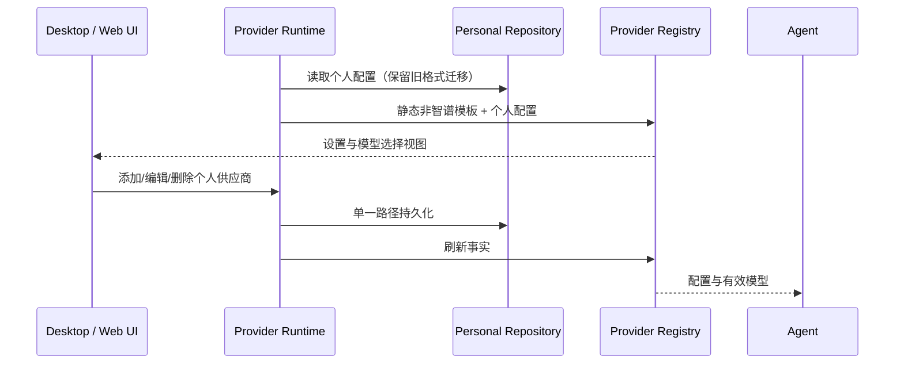

# 本地自定义供应商版本

## 产品规则

移除应用登录及智谱/Z.ai 内置供应商（BigModel、Coding Plan、Start Plan、团队与闲时套餐）。启动直接进入工作区，无供应商时允许进入模型设置添加自定义供应商。模型设置、模型选择与页脚不展示账号、登录、订阅或升级入口。

保留现有个人供应商、API Key、模型、排序、工作区和会话。用户手工填写的 API 地址不按域名封禁。内置推荐模板保留非智谱供应商；智谱内置模板及账号 Provider 不再播种。历史登录凭据保留在磁盘以便回退，但不会恢复、刷新或用于账号 API 请求。

## 所有者与边界

- Personal Provider Repository 唯一拥有用户供应商配置；Provider Registry 发布设置与模型选择视图。
- Host 只从随包静态模板和 Personal 配置组装 Registry，不读取旧 CDN active 缓存，不注册远端内置配置刷新。
- OAuth RPC 保留兼容边界：读取恒为 signed-out，登录/刷新明确失败，回调不接收账号，不发网络请求。
- 套餐 RPC 返回明确退役错误，Start Plan 和强制更新查询为空；动态工作流只读本地覆盖与现有默认值，不再查询 client/configs。
- OAuthCredentialRepo 的历史账号读取停用；credentialService 隔离 oauth:、account-provider: 和 zcodejwttoken 的历史读取；自定义 API Key 不变。
- UI 通过现有 hooks/facade 编辑供应商；页脚只保留偏好菜单与设置按钮。
- Desktop 连续流、手机恢复流、owner/lease、workspaceIdentity 与远程鉴权均保持现有协议。

## 验收

1. 带历史 OAuth 凭据启动：无账号展示、无登录页，不请求登录/套餐/权益 API。
2. 新安装且无自定义供应商：工作区可打开，模型设置可添加供应商；不强制登录。
3. 设置只展示个人供应商；添加、保存、排序、删除和模型编辑继续通过现有 facade。
4. 历史自定义配置保留；刷新和重启不恢复智谱内置 Provider。
5. OAuth RPC 及旧回调不能重新启用账号功能；自定义 API Key 保持可读。
6. 执行 Node 测试、typecheck、lint、architecture 检查；Electron E2E 检查设置页面和添加供应商，重建安装并保留旧 app 备份。

## 范围

本次移除账号和内置模型供应商服务，不删除远程 workspace 的连接鉴权，不改用户手动配置的模型服务。官方自动更新需在本地定制版本停用，避免重新覆盖本次移除行为。

## 2026-09-23 验证记录

- 服务端 15 项、UI 6 项 Node 测试通过；新增退役测试先失败后通过。
- `pnpm typecheck`、`pnpm architecture:check --changed`、改动文件格式检查通过；`pnpm lint` 为 0 错误、57 警告。
- Electron E2E 在隔离数据目录中验证无登录/内置供应商、自定义供应商创建、密钥/模型保存与刷新。
- 额外 `tsc -p packages/desktop/tsconfig.main.json --noEmit` 有 83 项错误；与原始 main 文件对比，无新增诊断。该入口并非根 typecheck 的组成部分。
- `.app` 本体的主进程、Host、Renderer、关键依赖、Agent、原生辅助程序和空内置供应商目录验证通过；本机临时签名通过深度严格校验。
- DMG 包装步骤发生 `plistlib.InvalidFileException`；安装直接使用校验通过的 `.app`，没有将 DMG 报为成功。
- 安装后实际设置页确认个人供应商仍在、账号供应商消失；供应商配置、旧配置、凭据文件的安装前后 SHA-256 一致。
