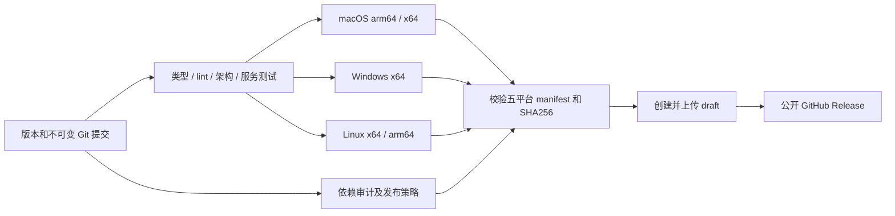

# UWork GitHub 多平台发布

## 发布规则

- 发布目标为用户 fork `Jas0nxlee/UWork`，默认分支 `uwork`；正式客户端身份为 `UWork` / `dev.zcode.app`，构建显式使用 `ZCODE_ENV=production` 和 `ZCODE_PREVIEW_IDENTITY=0`。
- 首次配置以 `v3.14.4` 发布，版本由根 `package.json` 提供。已有标签不移动，不覆盖其他版本的 Release。
- `uwork` push / PR 执行 lint、typecheck、架构与相关服务测试；版本标签或手工工作流执行五个原生构建：macOS arm64/x64、Windows x64、Linux x64/arm64。Node/pnpm 分别遵循 `mise.toml` 和 `packageManager`，Actions 固定完整提交 SHA。
- 构建复用现有 `bundle.mjs`。桌面安装包不依赖远程 mock CDN，CI 使用 `ZCODE_SKIP_REMOTE_ASSETS=1`，保留本地 Agent、插件、原生搜索工具、依赖闭包和平台校验。依赖和 Electron 从公开官方来源获取，个人企业身份配置和凭据不进入产物。
- macOS 输出 DMG/ZIP，Windows 输出 NSIS EXE，Linux 输出 AppImage/DEB/RPM/Arch 包。公开 CI 无开发者证书时使用明确启用的 macOS ad-hoc 签名并验证资源封印；不声称具有 Apple 公证或 Windows 发布者签名。
- 按用户选择，正式发布的依赖审计必须拒绝 high/critical，上传完整审计报告。不为本次发布配置审计忽略项或允许失败。

## 所有者和事件顺序

- 根版本和 Git 提交唯一决定构建身份。平台 build job 只产生当前提交的安装包与带 SHA256 的 manifest；publish job 唯一拥有 Release 创建与公开操作。
- publish 必须等待检查、审计策略和全部五个平台构建完成。汇总时重新验证版本、提交、平台矩阵、必需文件和校验和；任一目标失败不发布完整 Release。
- 构建 job 仅有 contents read；publish job 才有 contents write。输入先校验，再通过环境变量和独立脚本传递，不把用户输入插入 shell 代码。
- 发布先创建 draft，再上传全部已核验文件，最后公开；重跑只能补齐同一版本、同一提交的 draft。已公开 Release 不自动覆盖。保留旧版本和本机替换前的 `.app` 备份作为回退路径。

## 验收

1. 五个平台 workflow 实际运行成功，Release 包含所有必需格式、源码提交和 SHA256SUMS。
2. 文件被修改、缺少目标、版本或提交不一致时，汇总脚本失败且不发布。
3. macOS 安装副本的签名、版本和源码提交通过核验，主进程实际启动；Windows/Linux 分别记录构建及可用的运行验证，不能用 macOS 启动代替它们。
4. CI 的未执行、失败、依赖审计发现和签名限制如实记录。
