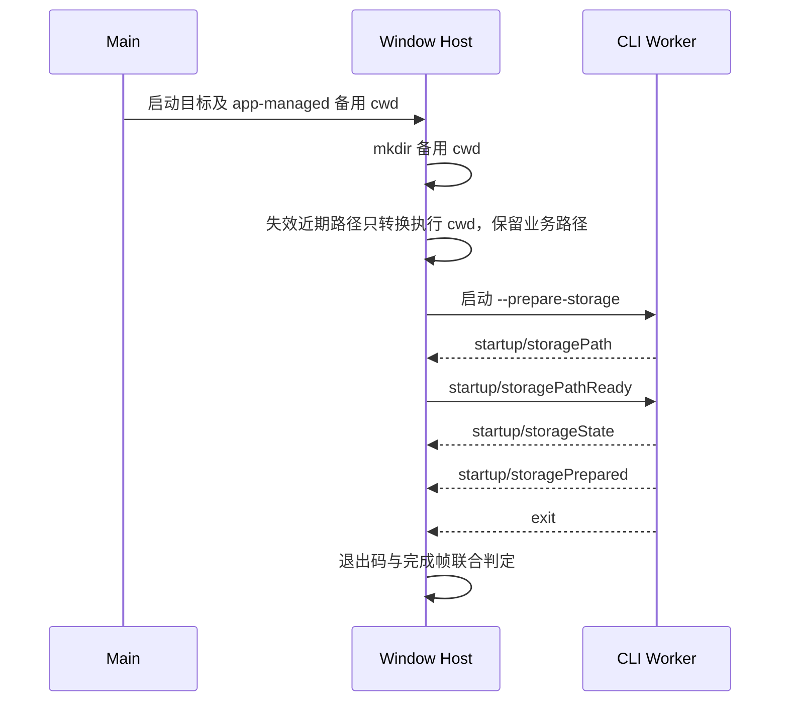

# Desktop 存储准备

Main 声明启动目标和 app-managed conversation 备用 cwd。Host 是该备用目录创建和启动准备状态的唯一所有者；每次准备都先创建备用目录，包括当前项目有效、非当前历史项目失效、仅远端历史会话和直接打开项目的情况，不能创建已删除的历史项目。tasks-index Worker 完成后，Host 为每个近期本地项目选择可用 cwd，失效路径退回已创建的备用目录，再启动配套 CLI 的 session 存储准备 Worker。CLI 通过有界 stdout 控制帧报告数据库路径、迁移状态和完成；Host 观察路径后从 stdin 回应。只有成功退出且收到完成帧才能进入服务初始化，不能把进程退出当作准备成功。

2026-09-29：完整安装包在此阶段报 transport_closed，但独立 Worker 探针成功。诊断只附加固定事实：退出码、收到的帧数、是否收到路径/完成帧、stderr 字节数及固定关键词分类；不记录 stderr 原文、环境变量值、真实路径、任务资料或凭据。错误 kind 与现有失败行为保持一致，先凭事实定位原因。

验收：配套 Worker 成功完成时进入 Root；缺少完成帧、非零退出、取消或无效控制帧不能进入服务初始化；安装替换前须通过完整包启动及本地跳过登录场景。

已确认缺陷：原 Main 只在没有历史窗口或当前项目失效时创建备用目录；当前项目有效、最近项目失效时，该目录可能不存在，Host 无法选择备用 cwd，CLI 在发送第一帧前退出。回归必须覆盖有效 active + 已删除 recent 的组合，验证备用目录存在、active 选择不变且已删除项目仍未创建。

验证：真实 Coordinator + tasks/CLI Worker 集成测试覆盖失效近期项目、显式打开、全新 Host 和目录创建失败四种场景；成功场景进入 ready，失败场景不初始化服务。最终正式包在新数据根进入 Root 并通过跳过登录操作；实际安装版在原数据根正常启动且恢复企业身份。Main 启动设置仍从 homedir 的历史设置入口读取，隔离设置来源问题单独记录，不在此次 cwd 修复中更改数据根迁移规则。
