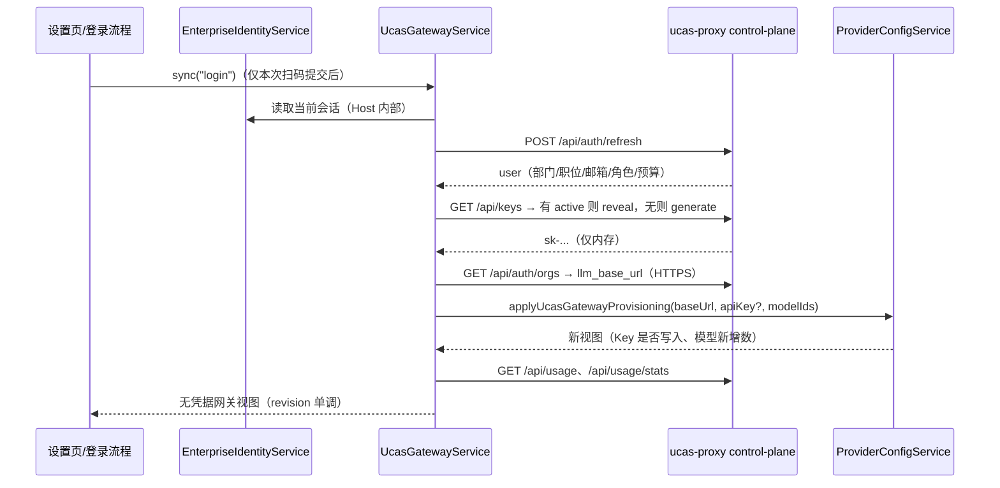

# 企业网关自动配置（UCAS Proxy 复用）

## 背景与目标

企业微信登录此前只提供姓名展示，模型 Key 与网关地址需要手工填写。本能力让已认证的 UWork 桌面客户端复用现有 ucas-proxy（control-plane）后台接口：

1. 读取企业用户资料（姓名、部门、职位、邮箱、头像、角色、月度预算）。
2. 自动配置默认 UCAS 供应商的 API Key（用户已有 active Key 时复用，没有时为企业账号生成）。
3. 自动配置网关地址（只取 HTTPS 公网入口 `llm_base_url`，不使用也不展示内网明文入口）。
4. 展示套餐（订阅额度、周期重置）与用量（请求数 / 费用 / Token 趋势与模型分布）。
5. 从当前套餐获取可用模型并补进 UCAS 供应商模型列表。

## 产品规则

- 本能力只在企业身份已认证时工作；未登录、已跳过时网关面板展示未登录空态，不发请求。只读手机 attachment 不触发登录后的自动同步，但可以查看桌面 Host 已同步的网关数据。
- 已有非空 UCAS API Key 的用户不被覆盖：默认只补缺失。用户可在网关面板显式执行「使用企业密钥替换」。
- 网关地址不是新的事实源：UCAS 供应商 Base URL 仍由 Provider Config 唯一持有，只是其固定值改为「网关端点覆盖值 ?? 随包默认值」。
- 网关入口固定为 HTTPS 公网地址；内网明文入口不进入客户端（不探测、不展示、不写 Provider 配置）。
- 模型同步是追加语义：只添加服务端返回且本地不存在的模型，不删除、不改参数、不改顺序、不启用/禁用既有模型。
- 套餐与用量是只读展示；本期不提供购买、重置、撤销 Key 的 UI。
- API Key 不在 UWork 界面呈现（面板不显示掩码 Key 与别名）；只保留「使用企业密钥替换」这一个显式动作，本地已有 Key 不被自动覆盖。
- 退出登录清除企业身份会话，但保留已写入的 UCAS Key 与网关地址（与本仓库既有的「退出不清除 Key」一致）；网关面板回到未登录态，不再刷新。
- 日志、错误文案不得写入 API Key 全文、JWT 或内网地址。

## 所有者与边界

| 事实                                            | 所有者                                               | 说明                                                    |
| ----------------------------------------------- | ---------------------------------------------------- | ------------------------------------------------------- |
| 企业身份会话（JWT）                             | `EnterpriseIdentityService` + `IdentitySessionStore` | 唯一写入者；网关服务只通过 Host 内部回调读取            |
| 网关快照（用户/端点/Key 元数据/套餐/用量/模型） | `UcasGatewayService`（新增，Host 服务）              | 内存视图 + 状态文件，只发布无凭据视图                   |
| UCAS Provider 配置（baseUrl/apiKey/模型）       | `ProviderConfigService` + Personal Repository        | 文件锁事务；网关只是写入方之一                          |
| 网关状态文件                                    | `UcasGatewayStore`（新增）                           | `{appConfigDir}/ucas-gateway.json`，原子私有写 + 文件锁 |

依赖方向：`services` → `provider`；`provider` 不认识 gateway 服务，只接受注入的 `ucasEndpointSource`（读端点覆盖值）。UI 只经 RPC 服务读取视图，不接触 JWT。

## 服务接口（RPC）

`IUcasGatewayService`（channel `ucas-gateway`）：

- `getView(): Promise<UcasGatewayView>`
- `sync(reason: string): Promise<UcasGatewaySyncResult>`：用户资料 → Key → 端点 → 应用 Provider → 模型 → 套餐/用量。
- `refreshUsage(input): Promise<UcasGatewayView>`：`period ∈ 7d|month|30d`，`metric ∈ requests|cost|tokens`，`force` 绕过服务端缓存。
- `refreshModels(): Promise<UcasGatewayView>`：只重读套餐可用模型，不写 Provider。
- `applyModels(): Promise<UcasGatewaySyncResult>`：把已读取的可用模型追加进 UCAS 供应商。
- `replaceApiKey(): Promise<UcasGatewaySyncResult>`：显式用企业密钥覆盖本地 Key。
- `onDidChange: Event<UcasGatewayView>`

视图字段（全部无凭据）：`revision`、`status ∈ signed-out|idle|syncing|ready|error`、`configured`（本机/随包企微配置是否存在）、`user`、`endpoint`、`key`（id/alias/maskedKey/status）、`subscriptions[]`、`usage`（summary/trend/models）、`models`（available/unrestricted/hasSubscription/applied 数）、`lastSyncedAt`、`error`。

## Provider 侧改动

- `ProviderConfigService` 新增依赖 `ucasEndpointSource?: { read(): Promise<string | undefined> }`；UCAS Base URL 解析为 `normalizeUcasGatewayBaseUrl(override ?? UCAS_BASE_URL)`。
  - `ensureSeededPersonalProvider` 每次启动把 UCAS Base URL 纠正为解析值（沿用原「固定地址」语义，但允许网关端点）。
  - `savePersonalProviderOverlay` 的固定校验改为与该解析值比较。
  - 新增 `applyUcasGatewayConfig({ baseUrl, apiKey?, replaceApiKey? })`：文件锁事务内写 `api.baseUrl`；`apiKey` 仅在缺失或 `replaceApiKey=true` 时写入。
- Base URL 规范：去尾斜杠；路径为空或 `/` 时补 `/v1`；已含路径时原样保留。

## 验收

- 未配置企微或未登录：网关面板显示空态，`sync` 返回未登录错误，不发网络请求。
- 首次登录且无 Key：自动生成/读取企业 Key 并写入 UCAS 供应商，登录后不再弹出原 Key 输入对话框；写入失败时回退到原对话框。
- 已有 Key：登录与同步不覆盖；`replaceApiKey` 才覆盖。
- 网关地址只取 HTTPS 公网入口：Provider Base URL 恒为 `<llm_base_url>/v1`；状态文件与视图不保留内网地址。重启后仍沿用上次解析值，无需重新登录。
- 套餐展示 `amount_total/amount_used/next_reset_time/status`；用量按周期与指标切换，`force` 刷新绕过缓存。
- 模型同步只追加；重复执行 `applyModels` 幂等（新增 0）。
- 定向单测覆盖：客户端解析与错误码、端点探测回退、Key 复用/生成、模型追加、状态文件读写、Provider 端点覆盖与 `applyUcasGatewayConfig`。

### 本次验证记录

- 2026-10-04：`packages/services/test/ucasGatewayService.test.ts`（6 项）与 `ucasGatewayProviderConfig.test.ts`（3 项）通过，覆盖未登录不发请求、内网优先 / 公网回退、复用与生成 Key、401 归类为 unauthorized 且不写 Provider、模型重复应用幂等、端点覆盖播种、Key 补缺 / 保留 / 显式替换、固定 Base URL 校验。
- 既有 57 项身份、UCAS 与模型发现测试全部通过；`pnpm typecheck`、`pnpm lint`（0 错误，56 条既有警告）、`pnpm architecture:check --changed`、`pnpm fmt:check` 通过。
- 未验证：真实企业微信扫码、与本机 ucas-proxy 实例的端到端联调、已安装 Desktop 客户端上的面板交互。上述 Node 测试使用注入的 fetch 与内存 Store，不代表真实服务响应。共享 UI 浏览器 E2E 需要先在本机 Chrome 允许远程调试（browser-harness 交互授权），本轮未执行；Electron 端到端同样未执行。

### 本地端到端联调（2026-10-04）

用本机假后端（HTTPS `https://127.0.0.1:9443` 模拟 control-plane + HTTP `http://127.0.0.1:14001` 模拟内网模型网关）与预置的加密会话，在真实 dev 实例（tsup + vite + Electron + Host）上验证：

- 会话恢复成功后自动触发 `sync("startup")`，请求序列与设计一致：`POST /api/auth/refresh`（身份）→ `POST /api/auth/refresh`（资料）→ `GET /api/keys` → `GET /api/keys/{id}/reveal` → `GET /api/auth/orgs` → 内网 `/models` 探测 → `GET /api/usage/models` → Provider 写入 → `GET /api/usage` / `GET /api/usage/stats`。
- Provider 实际写入：`api.baseUrl = http://127.0.0.1:14001/v1`（内网优先）、`access.apiKey = sk-local-test-key`（复用企业 Key）、模型 = 6 个默认 + `ucas-local-plan-only`（按套餐追加，原顺序保留）；`ucas-gateway.json` 落盘 endpoint/key 元数据。
- 内网不可达（连接被拒）时回退公网：`endpoint.source=public`、Provider `baseUrl=https://llm.example.com:15000/v1`。
- 已有本地密钥 `sk-user-entered-key` 未被覆盖，仅地址被同步为新端点。
- 重复同步幂等：模型 7 项、无重复。
- 应用日志无 API Key / JWT 明文，无 renderer 错误；`ucas-gateway` 通道注册、`getView`/`sync` RPC 正常。

本机联调注意事项（dev 环境，非本能力缺陷）：

- 从 App 内 Bash 工具启动 dev 时，宿主会注入 `ZCODE_BUILTIN_PROVIDER_CONFIG_FILE` / `ZCODE_PERSONAL_PROVIDER_CONFIG_FILE`，桌面主进程优先采用该显式路径（指向已安装版本的 CDN builtin 缓存，无 `ucas` 模板），表现为 `Provider Template 不存在: ucas` 且播种失败。用 `env -u ZCODE_BUILTIN_PROVIDER_CONFIG_FILE -u ZCODE_PERSONAL_PROVIDER_CONFIG_FILE pnpm dev:desktop:test` 或在普通终端启动即可恢复。
- Host 有意剔除 `NODE_EXTRA_CA_CERTS`（统一走桌面 custom CA 设置，`settings.httpProxyCaCertPath`）；本机模拟 HTTPS 控制面时用 `NODE_TLS_REJECT_UNAUTHORIZED=0`，仅限测试。
- 仍未验证：真实企业微信扫码、真实 ucas-proxy 服务、网关面板的视觉呈现与交互（需要 CDP/browser-harness 授权）。
