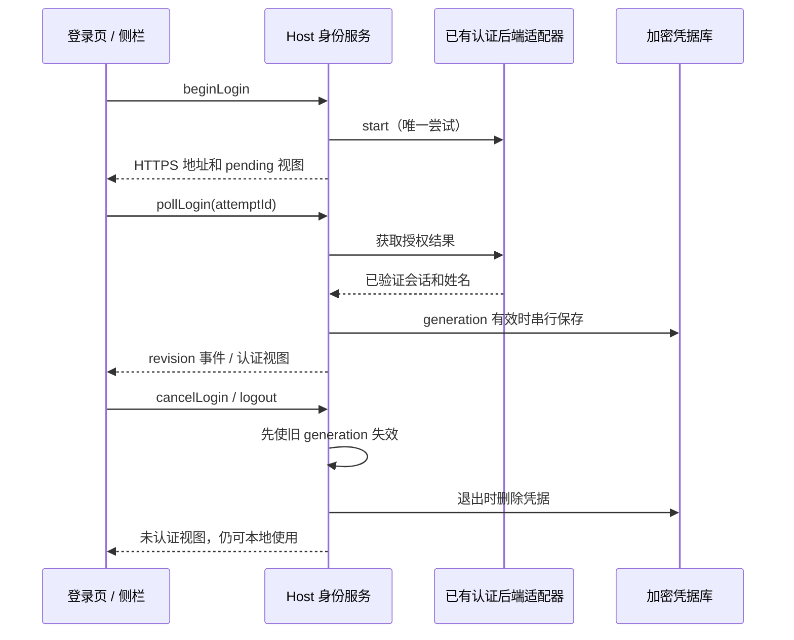

# UWork 可选企业身份登录

## 产品规则

- 桌面打开时，未认证用户看到登录页，首期只展示企业微信，始终可以“跳过登录，继续使用”。跳过只关闭当前窗口的登录页，重启后仍可选择登录。
- 侧栏 UWork 字标下：未登录显示可点击的登录入口；认证后显示姓名，点击查看来源并退出。右侧保留助理/开发切换。
- 有效会话自动恢复；过期、断网或恢复失败均允许跳过。缓存姓名不能冒充验证成功。
- 本轮身份只是本地应用的可选身份标签，不引入账号隔离、云数据或权限控制；现有工作区、会话、API Key、引导记录继续属于本地设备。登录/退出不认领、迁移或删除这些数据。
- 旧智谱/Z.ai OAuth 与套餐 RPC 继续退役。企业身份拥有独立类型、服务、事件与凭据命名空间。
- 用户已有认证服务，接口信息待提供。本轮完成客户端契约、服务与 UI。没有适配器时明确显示“企业微信登录暂未配置”，不请求网络、不制造登录结果、不另建后端。

## 所有者和边界

- Window-scoped Local Host 的 EnterpriseIdentityService 唯一拥有身份视图、登录尝试及加密凭据。Renderer 的 Zustand 只保存视图投影，登录页开关是 UI 状态。
- 应用层身份 Provider 固定使用 base services，远端工作区不能替换该身份。Main 仅通过 IPlatformService 打开经过校验的 HTTPS 授权地址，不保存业务状态。
- Node 注入的认证适配器映射已有后端为 start/poll/restore/revoke，正式适配待接口信息到位；Token 不进入 Renderer，Secret 不打包进 App。
- 通用 Credential RPC 隔离 enterprise-identity 命名空间的读、写和删除；身份服务在 Host 内持有原始凭据库。不能通过旧凭据接口伪造登录资料。
- RPC：getView、restoreSession、beginLogin、pollLogin、cancelLogin、logout、onDidChange。视图含单调 revision、configured、status、profile、pending，不含 Token。用户信息必须含稳定 ID、企业 ID、provider 和姓名。
- 开始/取消/退出使旧 generation 失效并中止请求；凭据写入串行化，发布事件在持久化完成后。迟到响应不能复活取消的登录或覆盖新会话。
- 断网保留加密凭据供重试，明确过期则清理；未配置适配器不恢复历史凭据。
- 正式认证适配器落地前需确定设备级会话在多个窗口之间的持久化和登出传播策略；本轮不声明多窗口真实登录联动已验证。
- 普通 Web 可使用同一入口；手机 attachment 只投影桌面 Host 的身份，不显示启动登录页，不另起身份服务。任务流、owner/lease、workspaceIdentity、desktop-continuous/web-remote-replayable 语义不变。

## 验收

1. 未配置服务：启动页有企业微信、未配置提示和跳过；跳过进入工作区，再次登录入口有效。
2. 注入测试适配器：成功后姓名显示在 Logo 下；持久化和恢复成功；退出保留本地功能。
3. 重复 start/poll 合并；取消/退出/恢复后的迟到结果无效，过期清理；事件无 Token。
4. 非 HTTPS 地址、无稳定用户/企业 ID、无姓名、无效有效期被拒绝；失败始终可跳过。
5. Electron E2E 验证跳过、重新打开、未配置提示、姓名投影和退出；成功路径只用隔离测试适配器，不声明真实企业微信登录通过。
6. 执行相关 Node 测试、pnpm typecheck、pnpm lint、pnpm architecture:check --changed；Web 与 attachment 边界分别记录证据。真实扫码等待已有服务接口和测试环境。

## 当前对接与验证记录

2026-09-29：已有网站公开前端确认 authorize、login(code/org_id)、refresh，当前授权 URL 是微信内网页授权。未取得桌面扫码结果回传契约；生产适配器仍未配置。详见 [对接说明](../docs/enterprise-identity-integration.md)。

- 相关 Node 测试 17 项通过，覆盖私有凭据边界、身份生命周期、过期、重复请求和迟到写入回滚。
- 共享 UI 浏览器 E2E 通过：跳过、再次打开、Esc、草稿保留、姓名位置、退出、320–1440px 布局、英文/深色/长姓名与 attachment 只读边界。成功身份来自隔离 fixture。
- pnpm typecheck 和 pnpm architecture:check --changed 通过；pnpm lint 为 0 错误、57 项既有警告。
- main/host/preload 与 renderer 生产构建曾通过。隔离 Electron 实例在数据库准备阶段发生 transport_closed，未进入 Root，桌面 E2E 未通过，未替换已安装应用。
- 真实企业微信扫码、服务端续期/吊销、跨窗口认证和远程 attachment 真实传输尚未验证。
