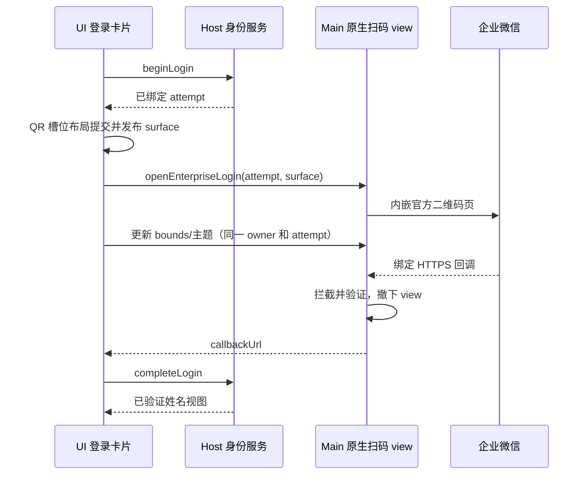
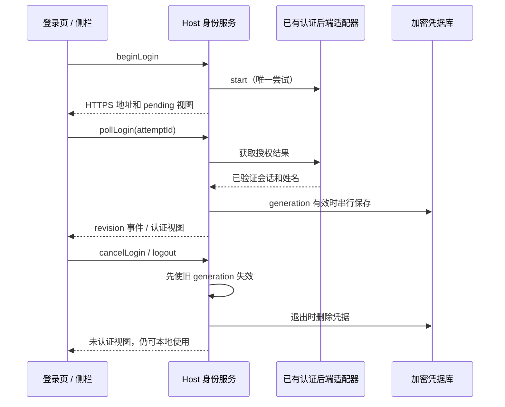
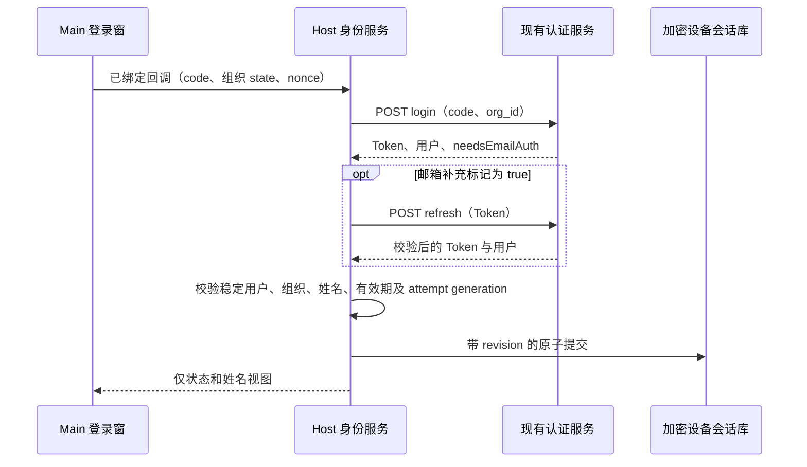
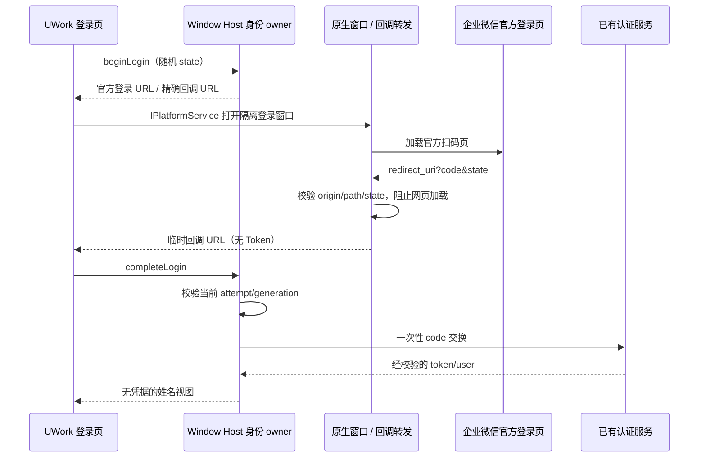

# UWork 可选企业身份登录

## 主窗口内嵌扫码改版

### 新版独立授权页布局修复（2026-09-29）

- 真实新版授权页使用 `wwLogin_standalone/wwLogin_frame/wwLogin_panel/wwLogin_qrcode`，可能直接在顶层绘制二维码。不能仅以旧版 `loginPanel/impowerBox` 或存在扫码 iframe 为布局依据。
- Main 的固定展示样式负责将新版 120px 顶部留白和 480px 固定面板改为槽位内自适应布局；隐藏扫码页的装饰性标题、重复品牌头和页脚，保留授权操作、扫码描述、失败/过期提示及刷新二维码操作。二维码连同白色安全留白完整显示并水平居中；不能通过改授权 URL 或降低整个网页缩放来掩盖裁切。
- UI 继续唯一拥有扫码槽位与主题，Main 按原 sender、attempt 和文档 generation 应用展示样式；Host 的登录尝试、回调校验、取消和共享身份版本规则保持现有契约。
- 验收同时覆盖直接绘制的新版 `wwLogin_*` 顶层页面与旧版扫码子 frame。隔离 Electron 场景在窄槽位、浅/深色及 1/1.25 倍缩放下检查二维码完整、居中和状态/刷新操作可见。安装后必须查看真实授权页，fixture 通过不能替代实际布局确认。

- 登录卡片删除 U 字母图形和 UWork wordmark，删除身份登录说明与本地功能说明；保留标题、登录操作、跳过操作和必要的未配置/失败/过期提示。
- 用户点击企业微信后，在同一登录卡片中显示二维码与授权状态。使用独立内存 partition 的 WebContentsView 挂在原 BrowserWindow 内，不创建第二个登录窗口，也不将远端登录页放入有应用权限的 Renderer。
- UI 是扫码区域几何、颜色和字体的唯一所有者，通过 IPlatformService 发布严格验证的 surface 快照。Main 只持有 native view、请求绑定和短期回调路由；Host 继续持有登录尝试和设备会话。布局必须实际挂载后才打开 native view，使用可取消的就绪握手，不能用延时猜测 DOM 是否已渲染。
- Main 内嵌已验证成功的新版 Web 登录 URL，完整保留其路径、编码、appid、agentid、org state 与带 nonce 的回调，不转换成旧版 qrConnect。用户实测旧版入口提示回调域不匹配，不能要求修改后台来迁就界面。远端装饰性标题、外卡片背景与字号由固定 CSS 适配；二维码保持白色安全边距，扫码/确认/失败等授权状态不隐藏。
- bounds 从 CSS viewport 换算到 Electron DIP，随窗口尺寸、缩放和 UI 主题更新；每条更新只作用于原 sender 和同一 attempt ID。颜色、字体等只接受有界样式值，不接受任意 CSS、脚本或 URL。
- 授权文档导航会使固定样式节点与 origin zoom 失效；Main 按文档 generation 清理样式缓存，在新文档完成后重新应用当前 UI 缩放和主题，旧异步样式任务不得覆盖新文档。
- 新版登录页包含独立的扫码 iframe。仅适配顶层文档会留下 iframe 的固定宽度、标题和白色外框并截断二维码。Main 必须把固定展示样式应用到同一 guest 内、官方白名单 origin 的每个授权 frame；不读取表单、二维码内容、Cookie 或网页资料。顶层仅将官方扫码 iframe 填满已测量槽位；子 frame 的 QR 和状态居中，保留安全留白与授权操作。每个 frame 加载/导航后按本次文档重新适配；不得更换授权地址或隐藏错误、确认等状态。
- 原有 HTTPS origin/端口/path、唯一 state、唯一 nonce、唯一 code 校验保持。跳过、关闭窗口、Renderer 重载、失效尝试与完成都撤下 view、关闭 WebContents 并清理独立会话；网络/认证失败仍可跳过。

验收：没有品牌块与两段冗余说明；点击后不增加 BrowserWindow，二维码在卡片内且浅/深色和字体一致；缩放、resize、窄屏不覆盖跳过按钮；跳过/取消/重载不遗留 view，迟到回调不能登录；真实扫码回调仍由原 Host 完成校验。Web/只读 attachment 不获取 native 登录权限。

改版验证：42 项相关 Node 测试通过；共享 UI E2E 覆盖文案删除、取消/失败恢复、窄屏 surface 更新和跳过，均通过。隔离 Electron fixture 确认只存在原 BrowserWindow，view 随取消撤下、回调页未先消费 code、允许域导航后 CSS 与 1.25 倍缩放重新应用。根项目 typecheck、架构检查通过，lint 为 0 错误和 57 项既有警告。额外 Main tsc 仍有 149 行既有诊断，新增扫码文件无诊断。内嵌 SDK 路由的真实扫码与视觉确认仍待测试窗口中的用户验证，不能用 fixture 登录代替。

## 产品规则

- 桌面打开时，未认证用户看到登录页，首期只展示企业微信，始终可以“跳过登录，继续使用”。跳过只关闭当前窗口的登录页，重启后仍可选择登录。
- 侧栏 UWork 字标下：未登录显示可点击的登录入口；认证后显示姓名，点击查看来源并退出。右侧保留助理/开发切换。
- 有效会话自动恢复；过期、断网或恢复失败均允许跳过。缓存姓名不能冒充验证成功。
- 本轮身份只是本地应用的可选身份标签，不引入账号隔离、云数据或权限控制；现有工作区、会话、API Key、引导记录继续属于本地设备。登录/退出不认领、迁移或删除这些数据。
- 旧智谱/Z.ai OAuth 与套餐 RPC 继续退役。企业身份拥有独立类型、服务、事件与凭据命名空间。
- 用户已有认证服务，Desktop 使用本机公开配置接入标准自建应用扫码。没有配置时明确显示“企业微信登录暂未配置”，不制造登录结果、不另建认证后端。

## 所有者和边界

- 设备共享的 IdentitySessionStore 唯一拥有加密会话和全局 revision；Window-scoped Local Host 的 EnterpriseIdentityService 拥有本窗口尝试及已验证视图。Renderer 的 Zustand 只保存投影，登录页开关是 UI 状态。
- 应用层身份 Provider 固定使用 base services，远端工作区不能替换该身份。Main 通过 IPlatformService 管理隔离授权窗口及临时回调路由，不保存身份或 Token。
- Node 适配器支持 start/complete/restore；poll 和远端 revoke 为可选能力。Token 不进入 Renderer，Secret 不打包进 App。
- 通用 Credential RPC 隔离 enterprise-identity 命名空间的读、写和删除；身份服务在 Host 内持有原始凭据库。不能通过旧凭据接口伪造登录资料。
- RPC：getView、restoreSession、beginLogin、pollLogin、cancelLogin、logout、onDidChange。视图含单调 revision、configured、status、profile、pending，不含 Token。用户信息必须含稳定 ID、企业 ID、provider 和姓名。
- 开始/取消/退出使旧 generation 失效并中止请求；凭据写入串行化，发布事件在持久化完成后。迟到响应不能复活取消的登录或覆盖新会话。
- 断网保留加密凭据供重试，明确过期则清理；未配置适配器不恢复历史凭据。
- 同一设备共享一个企业账号，登录和退出跨窗口同步；广播只触发从私有会话库读取并重新验证，不接受 UI 提供的姓名或 Token。
- 普通 Web 可使用同一入口；手机 attachment 只投影桌面 Host 的身份，不显示启动登录页，不另起身份服务。任务流、owner/lease、workspaceIdentity、desktop-continuous/web-remote-replayable 语义不变。

## 验收

1. 未配置服务：启动页有企业微信、未配置提示和跳过；跳过进入工作区，再次登录入口有效。
2. 注入测试适配器：成功后姓名显示在 Logo 下；持久化和恢复成功；退出保留本地功能。
3. 重复 start/poll 合并；取消/退出/恢复后的迟到结果无效，过期清理；事件无 Token。
4. 非 HTTPS 地址、无稳定用户/企业 ID、无姓名、无效有效期被拒绝；失败始终可跳过。
5. Electron E2E 验证跳过、重新打开、未配置提示、姓名投影和退出；成功路径只用隔离测试适配器，不声明真实企业微信登录通过。
6. 执行相关 Node 测试、pnpm typecheck、pnpm lint、pnpm architecture:check --changed；Web 与 attachment 边界分别记录证据。真实扫码等待已有服务接口和测试环境。

## 当前对接与验证记录

## 标准扫码接入增量（2026-09-29）

- 用户已提供 CorpID、AgentID；应用使用官方新版 Web 登录链接（login_type=CorpApp），不把微信内 snsapi_base 网页授权当成扫码登录。
- Desktop 通过 IPlatformService 打开独立 sandbox 登录窗口。Main 只管理该窗口、导航白名单、回调路由与关闭，不保存身份、Token 或登录业务结果。登录页面不启用 Node、不提供 preload，使用临时 session partition。
- Host 生成每次唯一的随机 state/attempt ID 和 5 分钟有效期；回调必须精确匹配配置的 HTTPS origin/path，并含相同 state 和唯一 code。截获回调后停止网页加载，避免网页和 Host 重复消费一次性 code。
- Host 使用已有 POST /api/auth/login（code、org_id）换取 token/user，user.id、user.org_id、user.name 与 JWT exp 必须通过校验，返回组织必须与配置一致。JWT 仅在受信 HTTPS 服务响应中用于读取有效期；恢复必须经 POST /api/auth/refresh 验证，不能以本地解码代替认证。
- 2026-09-29 实测服务返回 needsEmailAuth=true。现有网页先保存 Token/姓名，再尝试一次邮箱授权；后续即使该标记仍为 true 也可结束登录。因此该标记不能单独解释为身份认证拒绝。本期 UWork 仅展示姓名，不采集邮箱；收到该标记时，Host 必须先用返回 Token 请求已有 refresh 接口，只有服务确认会话有效、稳定用户/组织一致且姓名有效后才提交设备会话。refresh 拒绝、身份变化、缺失姓名或网络失败均不能登录；不修改服务、不伪造邮箱授权。

- HTTPS 网络通过已有 HostApiNetworkTransport，禁止重定向泄露 Bearer Token；不自动重试 code 交换。CorpID、AgentID、认证服务地址与回调仅保存在本机配置文件，不提交真实企业标识或内部地址；不保存企业微信 Secret。
- 企业服务公开前端只有本地退出语义，未确认远端吊销接口；App 退出只清理本地会话，不声称已吊销服务器 Token。
- 身份 RPC 新增 completeLogin(attemptId, callbackUrl)；原 poll 模式保持兼容，native callback 模式不轮询虚构接口。跳过、关闭登录窗口或退出使旧回调失效；原外部浏览器登录适配器仍按自身 poll 语义工作。
- 用户确认同一设备共享一个企业账号，登录和退出同步到所有窗口。加密 IdentitySessionStore 是设备会话唯一持久化事实源；窗口 Host 只拥有当前尝试和视图投影。跨 Host 文件锁覆盖版本比较、写入和取消回滚。
- 登录与退出递增全局 revision。beginLogin 记录起始 revision，complete 仅在该版本仍有效时写入；跨窗口退出后旧扫码不能复活身份。续期在相同账号与 revision 下以 Token 条件写入，不触发登录广播回环。
- 广播只携带 revision，不携带姓名或 Token；其它 Host 读取受保护的会话并通过后端续期验证后更新视图。过时广播忽略；不能信任 Renderer 发送的认证资料。手机 attachment 继续只读既有 Host 的身份。

增量验收：错误 state、重复参数、跨 origin/端口/path、非 HTTPS、任意导航和新窗口被阻止；重复/迟到 callback 不重放 code 交换；取消关闭原生窗口；真实扫码需要用户在企业微信确认，登录与续期响应仍需真实验证。

## 组织绑定修复

公开 OAuthCallback 前端将回调 state 传为 login(code, org_id)，服务的 authorize(org_id) 也将 state 设置为该组织 ID。CorpID 与服务的 org_id 是不同标识，不能省略组织绑定或将随机 UUID 当作 org_id。标准扫码适配器必须配置明确的 orgId，并在 code 交换时发送该值；缺失配置应在发起扫码之前拒绝。组织只在与已指定 CorpID 唯一匹配时自动绑定，不根据列表排序选择。

此前原生回调仍使用独立随机 state；没有收到该绑定回调或没有服务端认证成功时，不把企微内网页的登录状态视为 UWork 登录。后续回调方式须保留随机请求绑定和跨窗口 stale 防护，不能为了兼容组织路由而去掉防伪验证。

用户明确服务侧不能修改，并批准兼容方式：标准请求的 state 使用已绑定的 orgId；每次 attempt.id 仍由 Host 随机生成，在 redirect_uri 中以单个 uwork_nonce 参数传递。Main 和 Host 同时检查精确 origin/端口/path、唯一 nonce=attempt.id、唯一 state=orgId、唯一 code，拒绝多余参数。旧的随机 state 适配器仍按原验证路径处理。

仅在 UWork 控制的登录窗中可拦截回调（含 iframe）；独立的企微客户端或系统浏览器中的网页可能自行消费授权码，不声明能够控制它们。真实验证必须确认 UWork 确实收到自己的绑定回调并由后端交换成功。

## 认证失败诊断边界

真实扫码已进入 code 交换但失败时，必须区分 HTTP 拒绝、响应字段不匹配、额外验证、Token 格式/有效期和网络中断。Node 日志只输出固定 reason、HTTP status、已知错误分类或 schema 字段路径；禁止输出响应原文、授权码、Token、姓名、企业标识或内部地址。UI 继续使用简短失败提示，不以测试进程退出码或扫码确认冒充认证成功。

## 前一增量验证

2026-09-29：已有网站公开前端确认 authorize、login(code/org_id)、refresh，当前授权 URL 是微信内网页授权。未取得桌面扫码结果回传契约；生产适配器仍未配置。详见 [对接说明](../docs/enterprise-identity-integration.md)。

- 相关 Node 测试 17 项通过，覆盖私有凭据边界、身份生命周期、过期、重复请求和迟到写入回滚。
- 共享 UI 浏览器 E2E 通过：跳过、再次打开、Esc、草稿保留、姓名位置、退出、320–1440px 布局、英文/深色/长姓名与 attachment 只读边界。成功身份来自隔离 fixture。
- pnpm typecheck 和 pnpm architecture:check --changed 通过；pnpm lint 为 0 错误、57 项既有警告。
- main/host/preload 与 renderer 生产构建曾通过。隔离 Electron 实例在数据库准备阶段发生 transport_closed，未进入 Root，桌面 E2E 未通过，未替换已安装应用。
- 真实企业微信扫码、服务端续期/吊销、跨窗口认证和远程 attachment 真实传输尚未验证。

## 当前增量验证（2026-09-29）

- 真实扫码测试先定位到 needsEmailAuth 标记导致客户端拒绝；兼容实现随后完成 login 交换、refresh 校验、姓名校验和设备加密会话提交，测试进程输出 VERIFIED 并以 0 退出。
- 新测试进程读取已保存的同一设备会话，经真实 refresh 再次验证成功，无需重新扫码。真实姓名和 Token 未写入测试输出。
- 当前 41 项相关 Node 测试通过，包含邮箱标记的服务端再验证、拒绝续期、用户/组织变化以及脱敏诊断。typecheck、架构检查通过，lint 为 0 错误、57 项既有警告；当前 main/host/preload 和 renderer 生产构建通过。
- 后续完整启动确认问题来自已删除的 recent 项目与缺失的 conversation 备用 cwd；Host 改为准备前统一创建 app-managed 目录，保留历史业务路径。真实 Coordinator 覆盖已删除 recent、显式打开、全新 Host 和 mkdir 失败四个场景，均通过；44 项相关 Node 测试通过。
- 最终正式 app 本体通过依赖闭包、arm64 平台和严格本机签名验证，隔离安装包启动及跳过登录 E2E 通过。按用户授权替换 /Applications/UWork.app 后，真实设备会话自动恢复，主界面确认姓名存在且位于 UWork Logo 下，登录页自动关闭。真实多窗口退出同步仍未验证；既有同步 fixture 测试不能代替该验证。
- 没有修改已有认证服务。已有服务未提供吊销端点，退出只清除设备会话，不宣称远端 Token 被吊销。
