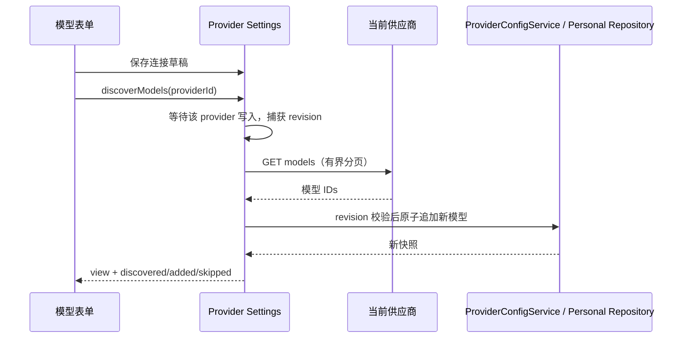

# 自动获取并添加供应商模型

## 产品规则

在模型列表的“添加模型”左侧提供“自动获取”按钮。点击后先保存当前地址、API 格式与密钥草稿，再由该设置页所属 Host 读取供应商模型列表，自动添加当前配置中不存在的模型 ID。加载期间禁止重复点击，完成显示发现、新增、已有数量；失败保留所有现有模型与配置。

首次没有模型也可获取。已有模型的启停、上下文、别名、顺序不变；新模型追加并使用现有智能配置默认值。UCAS 新发现模型应用固定默认元数据：1,000,000 上下文、支持文本和图片输入、推理等级 low/high/max。模型列表提供的是供应商可见的 ID，不等价于已逐个完成推理连通性测试。

## 接口与安全边界

- UI → useModelProviders → IProviderSettingsService.discoverModels(providerId)，不从 Renderer 发 HTTP 请求。
- Provider Settings 服务读取已保存的 effectiveConfig，通过注入的 Host ApiClient 请求；复用现有代理/CA 网络配置。
- 支持 OpenAI Chat Completions/Responses 与 Anthropic Messages 的模型列表。根地址补 `/v1/models`；带 API 前缀的地址保留前缀后拼 `/models`；已含推理路径的地址换成同级 models。根地址 404/405 时仅同源尝试 `/models`。
- OpenAI 使用 Bearer，Anthropic 使用 x-api-key 和 anthropic-version；保留用户配置的 headers。HTTP/HTTPS 自定义服务可用，禁止 URL 用户信息、查询凭据和重定向。密钥只发送到该供应商的同源地址，不记录响应原文或密钥。
- 单次总超时 15 秒，最多 20 页、5000 个 ID、4 MiB 响应；分页只使用服务返回的 last_id 构造同源 after_id，不跟随 next URL。去重、去掉空 ID，拒绝损坏结构及超预算的部分列表。
- Host 同一供应商进行中的发现请求合并；获取后按开始时的 Registry revision 校验。配置变化、供应商删除或跨 Host 文件修订冲突时拒绝整个导入，要求重新获取。
- ProviderConfigService 在现有 Personal Repository 事务内一次性合并新 ID，避免部分写入。Facade 复用按 provider 串行写入队列。

Desktop 与 Web 共用同一服务边界；不改 workspaceIdentity、Host owner/lease、desktop-continuous 或 web-remote-replayable 语义。远端旧 Host 未提供新方法时显示错误，不退回 Renderer 网络请求。

## 验收

- 根地址、/v1、带前缀和完整推理路径；OpenAI/Anthropic 认证与分页。
- 空列表、重复 ID、已有禁用模型、错误结构、401/403、404 fallback、重定向、超时与超预算。
- 新增一次性落盘，重复点击不重复新增；请求中改连接/删除供应商/并发写入不接受旧结果。
- UCAS 自动发现新增模型时保存 1M 上下文、文本/图片输入和 low/high/max 推理等级；已存在模型配置不被刷新覆盖。
- Electron E2E 用本地模型列表服务验证按钮位置、刚编辑的连接保存、加载提示、成功导入、重复获取和错误不丢模型；重建安装保留用户配置。

参考：[OpenAI Models](https://developers.openai.com/api/reference/resources/models/methods/list)、[Anthropic Models](https://platform.claude.com/docs/en/api/models/list)。

## 验证记录

2026-09-23：服务测试 23 项、UI 测试 6 项通过；其中发现协议与原子导入测试覆盖分页/认证、重复项、旧配置保留、请求合并和修订冲突。Electron E2E 使用独立本地接口完成模型获取、加载态、自动追加、重复点击不新增、401 后模型保留。未使用真实供应商密钥运行自动化测试。

`pnpm typecheck`、架构检查通过；Lint 为 0 错误、57 项既有警告。产物使用 macOS arm64 `.app` 目录打包，不依赖 DMG。

## 导入后编辑参数的版本传递

ModelProviderSection 必须把 useModelProviders 返回的 ProviderSettingsView.revision 传给模型编辑卡片。打开弹窗时记录该版本，保存时由原有 facade 校验；不得使用默认 0，也不能在保存瞬间用最新版本覆盖草稿版本以绕过冲突检查。真实并发修改仍应拒绝旧草稿。

回归场景：自动获取模型 → 修改上下文窗口并保存 → 重新打开确认；再修改一次，验证保存后的新版本继续生效。

该场景已用修复前 Electron 构建复现 `expected 0, current 8`，修复后两次参数编辑、保存、重开均通过。新增服务回归确认过期 basedOnRevision 仍会被拒绝，已保存的上下文不会被旧草稿覆盖。代码修复仅补充设置页到编辑卡片的 revision 传递，不修改服务端并发校验。
