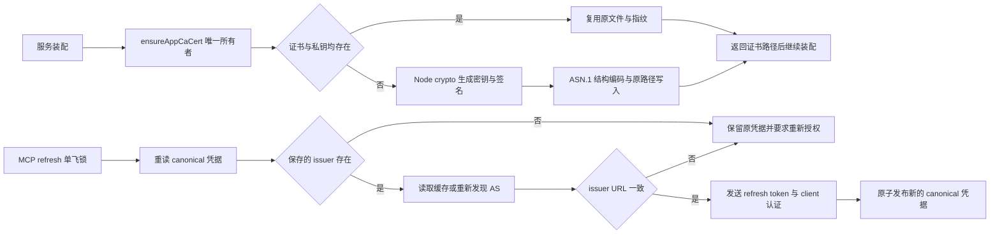

# 发布依赖安全修复

- 本次正式发布必须消除 `pnpm audit --prod --audit-level=high` 中的 high/critical 报告。按公告修复版本更新依赖，优先保留主版本；Electron 保留 41 系列并更新到 41.10.7。
- electron-builder 的 `electronVersion` 必须直接使用桌面 package.json 中的固定版本；通过加载真实打包配置的测试校验两者一致，禁止打包配置中的旧硬编码绕过已更新的锁文件。
- transitive resolution 由根 `pnpm-workspace.yaml` 的 overrides 唯一控制，提交根锁文件；不以忽略公告、修改审计返回值或临时目录中的修改绕过检查。
- 原有 React 固定版本和三份 dependency patch 同步迁到 workspace 配置，删除 package.json 中重复设置，避免 pinned pnpm 与外层新版 shim 对配置优先级的解释不同。
- `extract-zip@2.0.1` 没有上游修复版本。使用 workspace 包 `@uwork/safe-extract-zip` 作为已有 `extract-zip` 消费者的兼容适配器，公开接口仍为 `extract(zipPath, {dir, onEntry?, defaultDirMode?, defaultFileMode?}): Promise<void>`。这是工具链 ZIP 解包边界，不拥有身份、workspace 或应用状态。
- Playwright 的浏览器下载进程还内嵌旧解压实现，普通 override 不能替换它。对锁定的 `playwright-core@1.59.1` 添加可复现 patch，将该消费者切换到同一个公开解压入口；通过 packageExtensions 声明依赖，不在安装后的 node_modules 中保留手工改动。
- `yauzl` 负责有界、逐条读取和 ZIP entry size 校验；适配器唯一拥有当前解压流程。目录必须为绝对路径；ZIP entry 拒绝绝对路径、反斜杠、驱动器、空/点/父路径分量及 NUL。写文件前逐级验证父目录，不沿符号链接写入，不覆盖链接或特殊文件。
- 允许 Electron.framework 所需的相对内部链接；链接目标不得在逻辑或实际解析后离开 root。链接内容长度有界，全部链接在完成前再次校验。失败立即关闭归档并拒绝 Promise，不继续处理 entry。
- 调用方必须独占目标目录并提供受信回调。威胁模型包括不可信 ZIP 和原有文件/链接，不把拥有同等本机写权限、并发修改目录的进程当作该适配器能够隔离的对象。CI 的每个 build 使用独立 runner 和 checkout。
- 验收覆盖正常文件和执行权限、内部 Framework 链接、entry 路径穿越、绝对/外部链接、预存链接和通过链接覆盖外部文件；测试必须核对 root 外文件保持原值。另用真实 Electron 归档验证兼容性。
- 发布检查还包括 typecheck、lint、架构、登录/供应商及原生布局回归和五个平台的实际构建。审计通过仅表示当前数据库不再报告 high/critical，不表示不存在其他未知风险。

## 2026-10-08 新公告修复

- 升级 `basic-ftp` 至 6.2.1、`source-map-js` 至 1.2.2，并将实际使用的 MCP client 升至 2.2.0；根 overrides 和根锁文件仍是唯一的传递依赖解析来源。检查 MCP OAuth 的 issuer 绑定和凭据保存回归，不降低审计级别、不配置公告忽略项。
- 自定义 MCP refresh 直接调用 `refreshAuthorization`，不能只依赖 SDK 升级。沿用 canonical 凭据与跨进程 refresh 锁的唯一所有者，在发送 refresh token/client secret 前要求保存的 issuer 存在，并与本次新发现的授权服务器 URL 完全一致（仅规范化 URL 和尾部斜杠）；不允许以同域的另一条 issuer 路径替代。无 issuer 的历史凭据或 issuer 改变时返回既有 `unauthorized` 交互授权错误，保留原凭据，不做静默迁移；普通 discovery 网络错误仍沿用原有 proactive/reactive 区分。
- `node-forge` 尚无修复版，移除所有生产依赖和打包引用。唯一消费者 `appCaCert.ts` 保持同步初始化接口、原有证书/私钥文件名、已有证书复用和错误传播，由 Node 原生 crypto 生成 RSA-2048 密钥并以 SHA-256 签名，`@peculiar/asn1-x509` / `@peculiar/asn1-schema` 仅负责 RFC 5280 结构的 DER 编解码，不使用旧 RSA 签名验证实现。
- CA 状态所有者仍是服务 runtime-tools 的 `ensureAppCaCert`；生成顺序为检查完整现有证书对 → 生成密钥与证书 → 写入原有目录 → 返回路径，服务装配继续在创建子进程前完成初始化。验证证书为自签 CA、私钥匹配、2048 位 RSA、有效期十年、私钥权限 0600、重启复用不改变指纹。
- UI 只消费 `shadcn@4.1.1` 的静态 Tailwind CSS，不调用该 CLI。将这份 CSS 保存在 UI 的 styles 目录，除格式化空白外不改变内容，并保留 MIT 许可和来源；移除整包依赖，使 `braces`、旧 MCP SDK 与 `proxy-addr` 的未使用 CLI 链不再进入生产依赖。保留全部 Radix data-state / data-orientation variant 与动画，并验证 Web CSS 构建。
- 独立 debug 工作区的 `http-mitm-proxy` 仍需要 forge：保留调试功能，通过根 override 固定上游公开安全 PR #1152 的源码提交 `ceba34402e329f0365134f23fe19898756527d65`（源码版本 `1.4.1-0`），由锁文件记录归档完整性。该 PR 尚未合并、未发布 npm 正式版；必须执行真实 RSA 验签回归，确认正常签名通过、带额外嵌套 DigestAlgorithm 元素的签名被拒绝。来源：https://github.com/digitalbazaar/forge/pull/1152 。不配置审计忽略项，后续正式版发布时切回注册表版本。
- CI 增加自签 CA 和静态 CSS 回归检查；依赖审计仍使用原命令，必须返回 high=0、critical=0。升级失败、打包缺少新证书编码依赖、证书不匹配或 CSS variant 丢失均不得视为完成。

