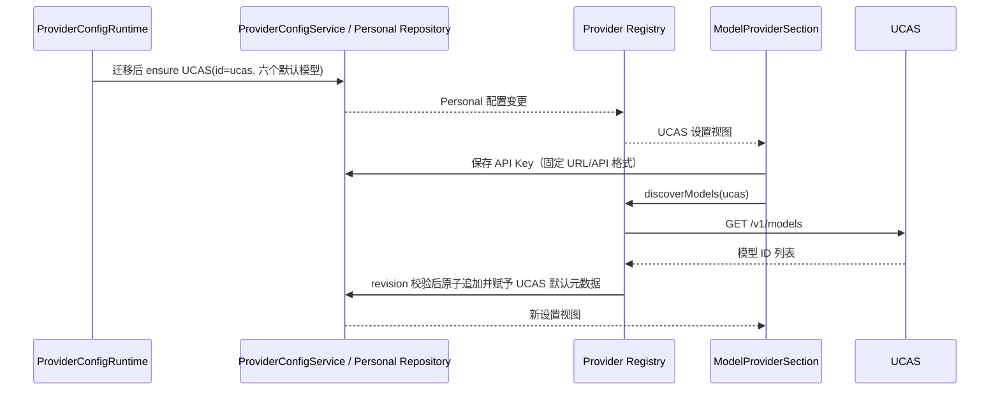

# UCAS 默认模型供应商

## 产品规则

- 首次启动时，模型设置默认出现唯一的 `ucas` 供应商；不配置默认 API Key。若旧配置已有 ID 为 `ucas` 或显示名为 `ucas` 的个人供应商，则迁移/合并到固定 ID `ucas` 和 UCAS 模板，固定名称/API 地址/API 格式，保留 API Key、已有模型参数和顺序，并补齐缺少的默认模型。
- UCAS Base URL 固定为 `https://lm.ucas.com.cn:15000/v1`，API 格式固定为 Chat Completions (`openai-chat-completions`)。名称、地址、格式和删除操作不可编辑；API Key、模型发现、模型启停与模型元数据仍可使用。
- 默认模型来自图片所示目录：`ucas-deepseek-flash`、`ucas-gpt-max`、`ucas-gpt-mini`、`ucas-kimi`、`ucas-glm`、`ucas-gemini-flash`。
- 默认模型及此后由 UCAS 自动发现的新模型均使用 1,000,000 上下文，启用文本和图片输入，推理等级为 low/high/max。重新获取不能覆盖已经存在的模型配置。
- “添加供应商”初始显示为灰色但仍响应点击。用户在同一次模型设置挂载期间连续点击此按钮 20 次后解锁；期间发生其他点击则清零。解锁是界面交互，不作为 Host/API 的安全授权边界。

## 状态所有者与接口

- ProviderConfigService 与 Personal Provider Repository 唯一拥有 UCAS 供应商和模型配置。ProviderConfigRuntime 在读取/迁移旧配置后，以固定 ID `ucas` 和模板 `ucas` 原子播种；已是 UCAS 模板的记录保持现状。历史自定义 `ucas` 记录（包括随机 ID、显示名为 `ucas` 的供应商）会在同一事务内合并到固定记录，保留密钥、已有模型元数据和排序，并只为缺失的默认模型写入默认值；默认模型选择同步到固定 ID。
- UCAS API 地址和格式由随包模板提供，并在 ProviderConfigService 保存边界校验，Renderer 隐藏编辑不构成唯一约束。
- ModelProviderSection 唯一拥有添加按钮的点击序列；组件卸载重置序列，其他区域点击重置计数。
- 自动发现继续使用现有 Provider Settings facade 和 Host 请求；结果在 revision 校验后与模型元数据一起原子保存。API Key 仅在保存的个人配置中，不写入模板或日志。

## 验收场景

1. 空配置及已有其他个人供应商的升级启动均出现唯一 UCAS；多 Host 并发初始化不产生重复 UCAS。旧自定义 `ucas` 记录迁移后保留密钥、已有模型配置和顺序、迁移默认模型选择，并补齐缺少的默认模型。
2. UCAS 初始 Base URL/API 格式正确，UI 不可编辑名称、地址、格式或删除；API Key 可以保存、重载后保留。
3. 六个默认模型均显示 1M，并支持文本与图片；推理等级仅有 low/high/max。自动发现新增模型具有相同默认值，已有模型配置不变。
4. 自动发现请求失败或 revision 过期不写入部分模型或改变现有配置。
5. 添加供应商按钮初始灰色，19 次连续点击仍关闭；第 20 次后变为可用；第 20 次后的点击打开现有供应商选择器；非按钮点击会重置序列。
6. 供应商设置具有服务测试和 Desktop E2E 覆盖；执行仓库要求的 `pnpm typecheck`、`pnpm lint` 和架构检查。
