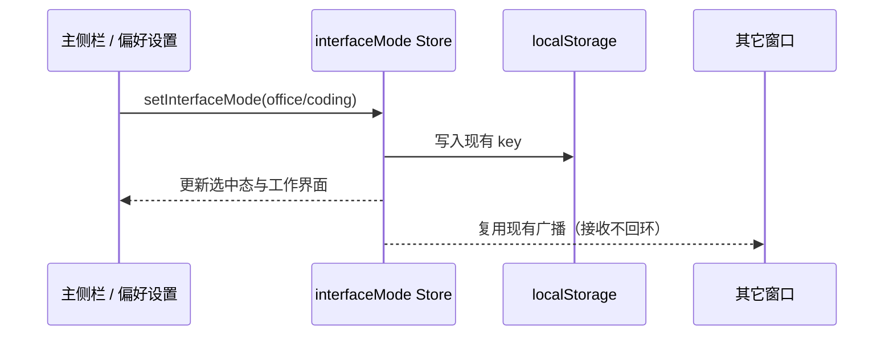

# UWork 品牌替换

显示名称统一为 UWork；应用、窗口标题、菜单、启动页、引导、关于页和主界面使用 UWork。主界面背景为 UCAS SVG 字样，深浅主题保持原有弱化效果。界面标识采用 SVG；macOS 图标从同一 U 造型的 SVG 源生成原生 ICNS/PNG。

只替换产品展示与打包名称，不修改内部包名、RPC/协议、用户数据目录 `.zcode`、workspaceIdentity、凭据格式或供应商配置。Electron 历史 userData 目录继续保留原路径，避免重命名后丢失窗口/浏览器数据。macOS 最终安装为 `/Applications/UWork.app`，原应用备份后移出应用程序目录。

验收：浅色/深色主界面展示 UCAS；SVG 图标可渲染；Finder/菜单/窗口为 UWork；原供应商和会话配置保持；自动获取模型功能同时交付。

## 主侧栏模式切换

主侧栏从上到下为 UWork SVG 字标、助理/开发分段按钮、新建任务。切换条最大宽度 192px，按钮使用 `text-ui-base font-bold`、紧凑内边距与选中背景，支持键盘焦点和 aria-pressed；窄侧栏允许收缩，不遮挡其它入口。

复用现有 Zustand interfaceMode 和 setInterfaceMode，内部值继续使用 office/coding，现有 localStorage 与广播防回环不变。中文展示统一改为“助理”“开发”，英文为 Assistant/Developer。只改变模式名称与入口位置，不改变模式本身的业务语义。

## 帮助菜单

主界面背景使用 UCAS SVG 字样，软件名称、左侧主字标为 UWork，应用图标为 U。

右上角帮助菜单仅保留“资源管理器”。删除文档、社区、问题反馈、产品建议、检查更新、关于等入口及仅供该菜单使用的动作封装、更新 hook。共用的原生菜单、资源管理器和其它独立功能保持各自入口，不通过隐藏空菜单占位；Web 无桌面资源管理器时不显示该按钮。

## 布局尺寸

模式切换条缩为最大 192px 宽，按钮垂直内边距 4px、外框内边距 2px；保持字体加粗。UCAS 背景最大宽度由 640px 放大至 832px，窄窗口继续按视口收缩；深浅主题均从中部开始向下渐隐，底部透明，避免干扰问候文字。

## 验证记录

2026-09-23：Electron 窗口验证了 UWork SVG 字标、模式入口顺序与重载持久化、帮助菜单仅含资源管理器。深浅主题截图确认 UCAS 放大与下半部渐隐；实测切换条 192×35px、背景容器 832px。macOS 包显示名和主可执行名均为 UWork，旧 Electron userData 路径保留。
