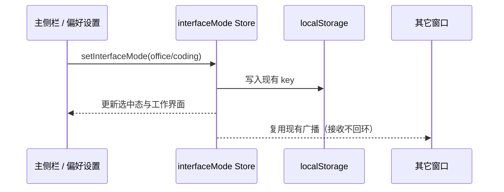

# UWork 品牌替换

显示名称统一为 UWork；应用、窗口标题、菜单、启动页、引导、关于页和主界面使用 UWork。主界面背景为 UCAS SVG 字样，深浅主题保持原有弱化效果。界面标识采用 SVG；macOS 图标从同一 U 造型的 SVG 源生成原生 ICNS/PNG。

只替换产品展示与打包名称，不修改内部包名、RPC/协议、workspaceIdentity、凭据格式或供应商配置。数据目录与 Electron userData 目录按 [UWork 独立数据根](uwork-data-root-separation.md) 使用 UWork 自己的命名空间（`~/.uwork`、`~/Library/Application Support/UWork*`），不做迁移。macOS 最终安装为 `/Applications/UWork.app`，原应用备份后移出应用程序目录。

验收：浅色/深色主界面展示 UCAS；SVG 图标可渲染；Finder/菜单/窗口为 UWork；原供应商和会话配置保持；自动获取模型功能同时交付。

## 显示与模型身份收口（2026-09-29）

- 正式显示及模型身份统一拼写为 `UWork`。覆盖原生菜单/关于页、浏览器与分享页、Server/TUI 文案、辅助程序显示名、进程显示名、内置技能描述以及模型可见的主代理/子代理/工作流/工具/提醒提示词。
- `User-Agent` 为 `UWork/<version>`，`X-Title` 为 `UWork@<source>`；请求头名称、`X-ZCode-App-Version`、Referer、服务地址和协议识别字符串保持兼容。
- CLI prefix、默认身份、Output Style 身份和 Desktop Context 均必须使用 UWork。`/init` 的品牌文案改为 UWork，实际指令文件路径仍为 `.zcode/AGENTS.md`；不得生成仓库不支持的新命令或目录。
- 包名、导出符号、wire 方法与键、应用/服务标识、历史 userData 路径、辅助程序安装文件名和用于兼容旧服务错误的匹配文本保持原值。原项目链接、作者归属和许可材料保留 ZCode 上游名称。
- 本轮仅修正文案和模型内容，由现有函数/组件生成，不增加新的状态所有者或写入路径。覆盖默认与 Output Style 两种身份拼装、主/子代理与工作流、菜单/关于页和请求头；重新构建后核对实际应用标题及产物中的主身份字符串。
- 在 GitHub 发布前完成品牌验收，旧候选流程取消；新版继续执行依赖审计和全部平台构建。

## 主侧栏模式切换

主侧栏顶部为同一行：UWork SVG 字标在左，单个模式切换按钮在右；下方是新建任务。按钮显示当前模式（助理/开发），点击或键盘 Enter/Space 切换为另一模式，title 与 aria-label 提示当前及目标模式。取消双按钮和外层分段背景，保持紧凑尺寸与加粗文字；窄侧栏优先缩小字标，不挤压按钮。

复用现有 Zustand interfaceMode 和 setInterfaceMode，内部值继续使用 office/coding，现有 localStorage 与广播防回环不变。中文展示统一改为“助理”“开发”，英文为 Assistant/Developer。只改变模式名称与入口位置，不改变模式本身的业务语义。

```mermaid
sequenceDiagram
  participant UI as 主侧栏 / 偏好设置
  participant Store as interfaceMode Store
  participant Disk as localStorage
  participant Other as 其它窗口
  UI->>Store: setInterfaceMode(office/coding)
  Store->>Disk: 写入现有 key
  Store-->>UI: 更新选中态与工作界面
  Store-->>Other: 复用现有广播（接收不回环）
```

## 帮助菜单

主界面背景使用 UCAS SVG 字样，软件名称、左侧主字标为 UWork，应用图标为 U。

右上角帮助菜单仅保留“资源管理器”。删除文档、社区、问题反馈、产品建议、检查更新、关于等入口及仅供该菜单使用的动作封装、更新 hook。共用的原生菜单、资源管理器和其它独立功能保持各自入口，不通过隐藏空菜单占位；Web 无桌面资源管理器时不显示该按钮。

## 布局尺寸

单个模式按钮高 32px，字标与按钮间距 8px；保持字体加粗，不再使用模式分段背景。UCAS 背景最大宽度由 640px 放大至 832px，窄窗口继续按视口收缩；深浅主题均从中部开始向下渐隐，底部透明，避免干扰问候文字。

## 验证记录

2026-09-23：Electron 窗口验证了 UWork SVG 字标、模式入口顺序与重载持久化、帮助菜单仅含资源管理器。深浅主题截图确认 UCAS 放大与下半部渐隐；背景容器最大宽度 832px。macOS 包显示名和主可执行名均为 UWork，旧 Electron userData 路径保留。

单按钮修订验证：Electron E2E 确认 Logo 右侧仅有一个按钮，点击切换当前模式，重载保留选择，Enter 可切回；同时验证帮助菜单及模型自动获取未回归。类型检查、架构检查通过，Lint 0 错误、57 项既有警告。

## 图标柔化（2026-10-05）

- 图标与界面共用同一 U 造型：`packages/desktop/build/uwork.svg` 是唯一源，经 `scripts/build-uwork-icons.cjs` 生成 PNG/ICNS/ICO 与 `icons/*.png`；界面标记（`UWORK_MARK_PATH`）使用同一几何。
- 轮廓从方头直角改为圆头笔画 + 连续圆角（外底 r88 / 内底 r32 / 圆头 r28，笔画宽度 **56**，外接尺寸 176×204 不变），底板改为近 macOS 连续曲率的 squircle，并加入轻微渐变、柔光与极淡顶缘内高光；不改变单色深底 + 浅色 U 的品牌识别。
- 字形在底板内必须**几何居中**：以 1024 画布为例，字标包围盒 x 292..731 / y 257..766（`translate(192 227) scale(2.5)`），左右留白 228/229、上下留白 193/194（容差 2px）；字形占底板约 49% 宽 × 57% 高，1024 下笔画实测 140px（对应 16px 图标约 2.2px）。缩小字形时必须同步加粗笔画（46 → 56），否则笔画相对底板显细。调整大小只改 scale 与配套 translate（`translate = 边距 - 路径左上偏移×scale`）。生成后按像素掩码复核，不能只看小尺寸是否"顺眼"——`transform` 必须减去路径自身左上偏移（路径 x 从 40 起，`translate` 要用 `左边距 - 40×scale`）。
- 开发态（未打包、macOS）由 Main 用 `build/icon.png` 覆盖 Dock 图标：dev 运行的是 Electron 原生包，不覆盖会显示 Electron 默认图标，无法核对真实图标。
